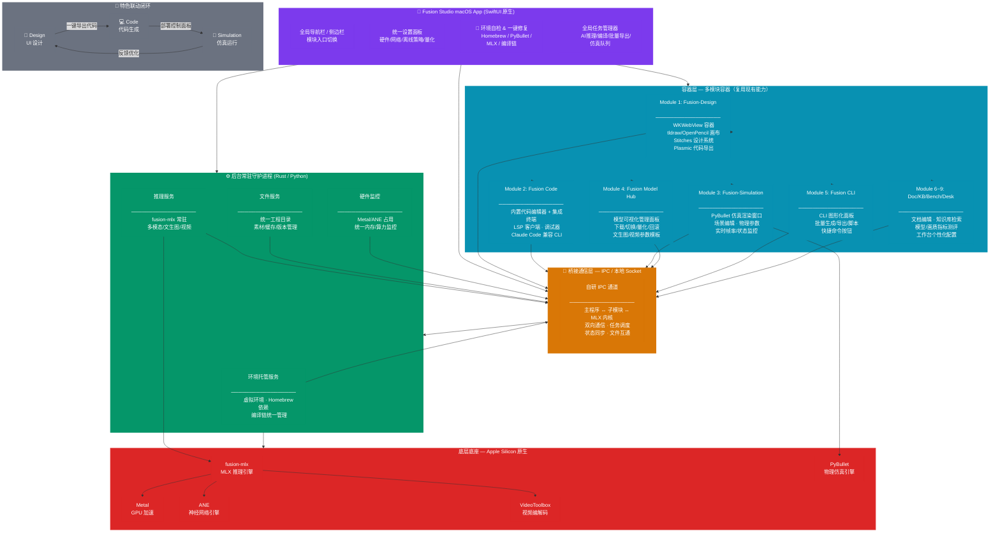
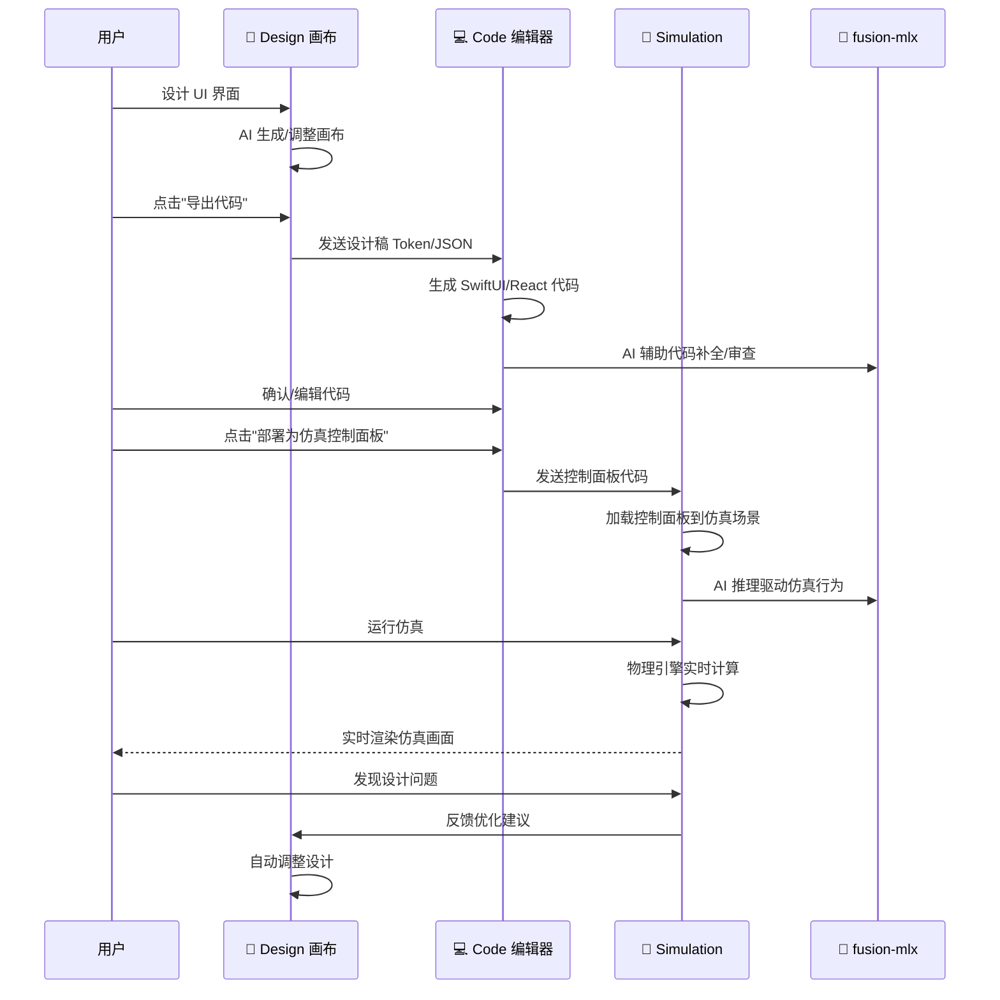
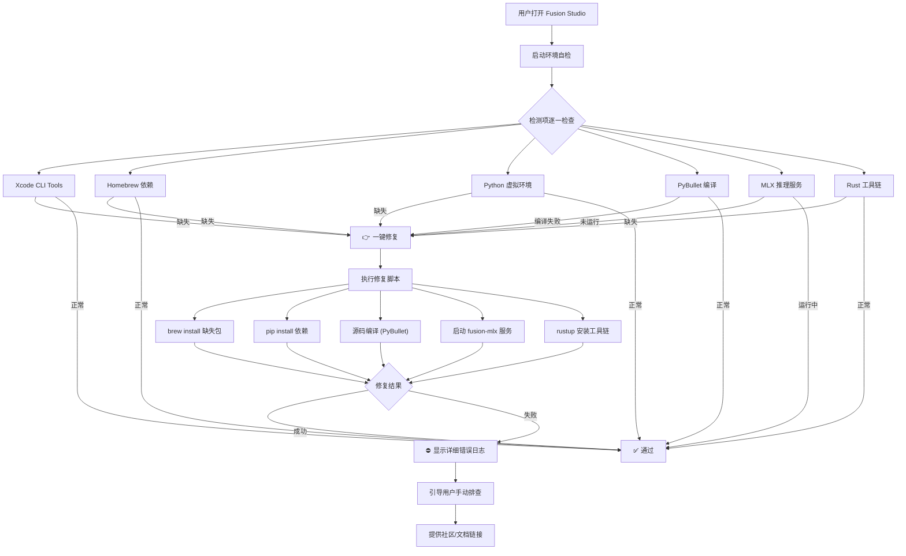

# Fusion Studio — 统一 macOS 桌面客户端架构文档

> **版本**: V0.1 MVP · **更新**: 2026-07-17
> 将 Fusion-MLX「一核九端」产品矩阵收口为单一 macOS 原生桌面应用

---

## 一、现有资产 → 模块映射

| 现有模块 | 物理路径 | 技术栈 | Fusion Studio 中角色 |
|---------|---------|--------|-------------------|
| **fusion-mlx** | `~claude-home/fusion-mlx` | Python/MLX | 🧠 核心推理引擎（常驻服务） |
| **fusion-cli** | `~/fusion/fusion-cli` | Rust | 🚪 CLI 可视化面板 + 后台服务 |
| **fusion-design** | `~/fusion/fusion-design` | Rust (7 crates) | 🎨 Module 1: AI 设计画布 |
| **fusion-coder** | `~/fusion/fusion-coder` | Python | 💻 Module 2: AI 编码 |
| **fusion-simulation** | `~/fusion/fusion-simulation` | Python | 🤖 Module 3: 机器人仿真 |
| **fusion-model-hub** | `~/fusion/fusion-model-hub` | Python | 📦 Module 4: 模型管理 |
| **fusion-doc** | `~/fusion/fusion-doc` | Node.js | 📄 Module 6: 文档管理 |
| **fusion-kb** | `~/fusion/fusion-kb` | Python | 📚 Module 7: 知识库 |
| **fusion-bench** | `~/fusion/fusion-bench` | Python | 📊 Module 8: 基准测试 |
| **fusion-desk** | `~/fusion/fusion-desk` | Python+Swift | 🧹 Module 9: 桌面自动化 + 原生容器 |
| **fusion-agent-studio** | `~/fusion/fusion-agent-studio` | Python | 🤖 Agent 工作流编排 |
| **fusion-security** | `~/fusion/fusion-security` | Python | 🔒 代码安全审计 |
| **fusion-science** | `~/fusion/fusion-science` | Python | 🔬 科学计算 |
| **fusion-finance** | `~/fusion/fusion-finance` | Python | 💰 金融分析 |
| **fusion-health** | `~/fusion/fusion-health` | Python | 🏥 医疗健康 |
| **fusion-k12-teacher** | `~/fusion/fusion-k12-teacher` | Python | 📚 智能教育 |
| **fusion-multi-nodes** | `~/fusion/fusion-multi-nodes` | Python | 🌐 分布式计算 |
| **fusion-plugins-ecosystem** | `~/fusion/fusion-plugins-ecosystem` | Python | 🔌 插件生态 |
| **fusion-code-modelization** | `~/fusion/fusion-code-modelization` | Python | 🏗️ 代码建模/重构 |

---

## 二、整体架构图



---

## 三、分层架构详解

### 3.1 应用层 — Fusion Studio 主程序 (SwiftUI)

```
Fusion Studio.app/
├── FusionStudioApp.swift          # @main 入口
├── Navigation/
│   ├── SidebarView.swift          # 侧边栏导航（模块入口切换）
│   ├── TabBarView.swift           # 底部标签栏
│   └── ModuleRouter.swift         # 模块路由分发
├── Settings/
│   ├── SettingsView.swift         # 全局设置面板
│   ├── HardwareSettings.swift     # 硬件/加速策略
│   ├── NetworkSettings.swift      # 离线策略/网络管控
│   └── QuantSettings.swift        # 量化预设
├── Environment/
│   ├── HealthCheckView.swift      # 环境自检 UI
│   ├── RepairEngine.swift         # 一键修复引擎
│   └── DependencyManager.swift    # 依赖管理（brew/pip/编译）
├── TaskManager/
│   ├── TaskQueueView.swift        # 全局任务队列
│   ├── TaskRunner.swift           # 后台执行器
│   └── TaskHistory.swift          # 任务历史
└── Common/
    ├── ThemeManager.swift          # 主题管理
    ├── IPCClient.swift             # IPC 通信客户端
    └── Logger.swift                # 统一日志
```

### 3.2 容器层 — 模块复用策略

| 模块 | 容器方式 | 复用资产 | 改动量 |
|------|---------|---------|--------|
| Fusion-Design | WKWebView 嵌入 | tldraw/OpenPencil 前端画布 | 极小（仅加通信桥接） |
| Fusion Code | 内置 CodeEditor + Terminal | fusion-coder Python CLI | 中（封装为 IPC 服务） |
| Fusion-Simulation | 独立 Metal 渲染窗口 | PyBullet Python 引擎 | 中（嵌入渲染视图） |
| Model Hub | 原生 SwiftUI 面板 | fusion-model-hub API | 小（API 调用封装） |
| CLI 可视化 | 原生 SwiftUI 表单 | fusion-cli Rust 二进制 | 小（进程调用封装） |
| Doc/KB/Bench/Desk | 原生/Web 混合 | 现有 Python/Node 服务 | 中（统一 IPC 接入） |

### 3.3 桥接通信层 — IPC 协议设计

```
┌──────────────┐     JSON-RPC 2.0      ┌──────────────┐
│  SwiftUI App  │ ◄──────────────────► │  Python/Rust  │
│  (主进程)     │    Unix Domain Socket  │  (子进程服务) │
└──────────────┘                        └──────────────┘

消息格式:
{
  "jsonrpc": "2.0",
  "id": 1,
  "method": "module.action",
  "params": { ... }
}

核心方法:
- env.health_check     → 环境自检
- env.repair           → 一键修复
- mlx.infer            → 推理调用
- model.list/pull/del  → 模型管理
- design.export_code   → 设计导出
- sim.run/stop/status  → 仿真控制
- task.submit/status   → 任务队列
```

### 3.4 服务层 — 后台守护进程

```bash
# 后台服务架构（多进程，心跳保活）
fusion-studio/
├── services/
│   ├── env-daemon/          # Rust — 环境托管
│   │   ├── Cargo.toml
│   │   └── src/main.rs      # brew/pip/编译链管理
│   ├── mlx-daemon/          # Python — MLX 推理常驻
│   │   ├── server.py         # fusion-mlx HTTP 服务封装
│   │   └── monitor.py        # 硬件监控
│   ├── file-daemon/         # Rust — 文件服务
│   │   ├── Cargo.toml
│   │   └── src/main.rs      # 统一工作区/版本管理
│   └── supervisor/          # Rust — 进程管理器
│       ├── Cargo.toml
│       └── src/main.rs      # 启动/停止/重启/心跳
```

---

## 四、阶段落地计划

### 阶段 1: V0.1 MVP（1-2 周）

```
目标: 三大核心模块收口 + 解决环境配置痛点

Week 1:
├── SwiftUI 主框架搭建
│   ├── 侧边栏导航 + 全局设置页
│   └── 环境自检 UI 框架
├── 环境自检 & 一键修复引擎
│   ├── Homebrew 依赖检测
│   ├── PyBullet 编译检测
│   ├── MLX 环境检测
│   └── 自动修复脚本
└── fusion-mlx 常驻服务封装
    ├── 启动/停止/健康检查
    └── 统一 IPC 通道

Week 2:
├── Fusion-Design 画布嵌入
│   ├── WKWebView 容器
│   └── OpenPencil 画布加载
├── Fusion Code 代码面板
│   ├── 内置代码编辑器
│   └── 集成终端
├── 统一工作区目录
│   └── ~/FusionStudio/workspace/
└── 基础模块联动
    ├── Design ↔ Code 单向导出
    └── 全局任务队列 MVP
```

### 阶段 2: V0.2 能力补齐（2-3 周）

```
Week 3-4:
├── Fusion-Simulation 仿真窗口
│   ├── PyBullet 渲染视图嵌入
│   ├── 场景编辑器
│   └── 物理参数面板
├── Model Hub 可视化管理
│   ├── 模型列表/详情
│   ├── 下载/切换/量化
│   └── 参数模板预设
├── CLI 图形化面板
│   ├── 常用命令快捷按钮
│   ├── 批量任务脚本
│   └── 执行日志
└── 模块间联动增强
    ├── Design → Code → Simulation 三连
    └── 任务队列增强（进度/暂停/取消）

Week 5:
├── Doc/KB/Bench 基础面板
├── 日志面板
├── 硬件监控仪表盘
└── 性能优化（启动速度、内存占用）
```

### 阶段 3: V1.0 正式版（1 个月+）

```
Week 6-8:
├── 全部 9 子模块入口补齐
├── 应用签名 & 公证
├── DMG 打包分发
├── 自动版本更新
├── 配置同步 & 模板备份
├── 长时运行稳定性
├── 内存泄漏修复
└── 用户文档 & 使用指南
```

### 阶段 4: 迭代优化（长期）

```
├── 团队局域网轻量协作
├── 高级画质/仿真参数调节
├── 插件体系（第三方扩展）
├── 更多硬件适配
├── CI/CD 流水线
└── 用户反馈闭环
```

---

## 五、技术选型总表

| 层次 | 技术 | 选型理由 |
|------|------|---------|
| UI 框架 | **SwiftUI** | macOS 原生，最优性能，适配 Apple Silicon |
| 内嵌网页 | **WKWebView** | 复用 Fusion-Design 前端画布，无需重构 |
| 代码编辑器 | **CodeEditorView** (开源) | 原生 SwiftUI 代码编辑组件 |
| 集成终端 | **TerminalView** (开源) | 原生终端模拟组件 |
| IPC 通信 | **Unix Domain Socket + JSON-RPC 2.0** | 轻量、稳定、跨语言 |
| 后台服务 | **Rust** (主) + **Python** (子) | Rust 轻量高性能，Python 复用现有资产 |
| 仿真渲染 | **Metal 视图 + PyBullet** | 原生 GPU 加速，复用现有引擎 |
| 数据存储 | **SQLite** | 零配置、本地优先 |
| 打包分发 | **Xcode Archive + 公证 + DMG** | 标准 macOS 分发流程 |
| 环境管理 | **内置 venv + Homebrew 封装** | 屏蔽底层复杂度 |

---

## 六、目录结构规划

```bash
~/fusion/fusion-studio/
├── FusionStudio.xcodeproj/          # Xcode 工程
├── FusionStudio/
│   ├── FusionStudioApp.swift        # @main 入口
│   ├── Navigation/                  # 导航
│   ├── Settings/                    # 设置
│   ├── Environment/                 # 环境自检
│   ├── TaskManager/                 # 任务队列
│   ├── Modules/                     # 模块容器
│   │   ├── Design/                  # WKWebView 容器
│   │   ├── Code/                    # 代码编辑器
│   │   ├── Simulation/              # 仿真窗口
│   │   ├── ModelHub/                # 模型管理
│   │   ├── CLI/                     # CLI 面板
│   │   ├── Doc/                     # 文档
│   │   ├── KB/                      # 知识库
│   │   ├── Bench/                   # 基准测试
│   │   └── Desk/                    # 桌面自动化
│   ├── Bridge/                      # IPC 通信
│   ├── Common/                      # 公共组件
│   └── Resources/                   # 资源文件
├── Services/                        # 后台守护进程
│   ├── env-daemon/                  # Rust
│   ├── mlx-daemon/                  # Python
│   ├── file-daemon/                 # Rust
│   └── supervisor/                  # Rust
├── Workspace/                       # 默认工作区
│   ├── designs/                     # 设计文件
│   ├── projects/                    # 代码工程
│   ├── simulations/                 # 仿真场景
│   └── models/                      # 模型权重(软链)
├── Scripts/                         # 构建/打包脚本
│   ├── build.sh
│   ├── sign.sh
│   └── package.sh
├── docs/                            # 文档
│   └── ARCHITECTURE.md
└── README.md
```

---

## 七、核心联动流程

### 7.1 Design → Code → Simulation 三连联动



### 7.2 环境自检 & 一键修复流程



---

## 八、与现有产品定位关系


---

## 九、关键设计决策

| 决策 | 选项 | 选择 | 理由 |
|------|------|------|------|
| 主程序框架 | SwiftUI vs Electron | **SwiftUI** | 原生性能、Apple Silicon 最优、最小包体 |
| 多进程通信 | gRPC vs Unix Socket vs HTTP | **Unix Socket + JSON-RPC** | 轻量、零依赖、跨语言、本地通信足够 |
| 后台服务语言 | Rust vs Python vs Go | **Rust (主) + Python (子)** | Rust 管理进程/环境，Python 复用现有推理代码 |
| 仿真渲染 | Metal vs OpenGL vs WKWebView | **Metal 视图** | 原生 GPU 加速，PyBullet 原生支持 Metal |
| 代码编辑器 | CodeEditorView vs Monaco vs CodeMirror | **CodeEditorView (SwiftUI)** | 原生集成、轻量、无需 WebView |
| 包管理 | Homebrew 封装 vs 自建 | **Homebrew 封装** | 复用现有生态，屏蔽命令行细节 |
| 模型存储 | App 内 vs 全局共享 | **全局共享 (~/.fusion/models)** | 多个模块共用，避免重复下载 |
| 启动策略 | 全量启动 vs 按需加载 | **按需懒加载** | 启动快、内存省 |

---

## 十、风险与应对

| 风险 | 影响 | 概率 | 应对方案 |
|------|------|------|---------|
| App 包体过大 | 下载/安装慢 | 中 | 模块懒加载，模型/依赖不打进包体 |
| 多进程通信不稳定 | 功能异常 | 中 | 心跳检测 + 自动重启，崩溃不影响主 UI |
| macOS 沙箱限制 | 功能受限 | 高 | 开发阶段关闭沙箱，分发时按需申请权限 |
| 原有模块适配成本 | 开发周期延长 | 中 | 仅做容器封装 + 通信对接，不重构底层 |
| PyBullet 编译问题 | 仿真模块不可用 | 高 | 内置预编译二进制兜底，一键修复脚本 |
| 内存泄漏 | 长时运行崩溃 | 中 | 分模块内存隔离，异常进程自动重启 |

---

> **Fusion Studio** — 把「一核九端」收口为一个 App，让本地 AI 开箱即用。